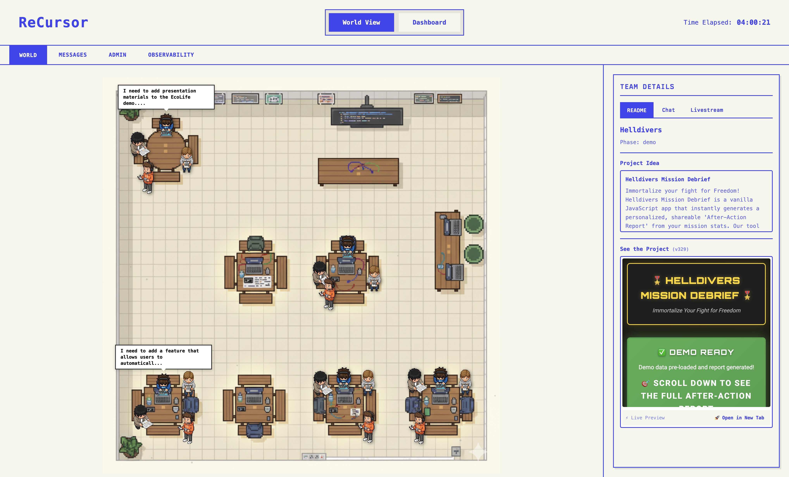
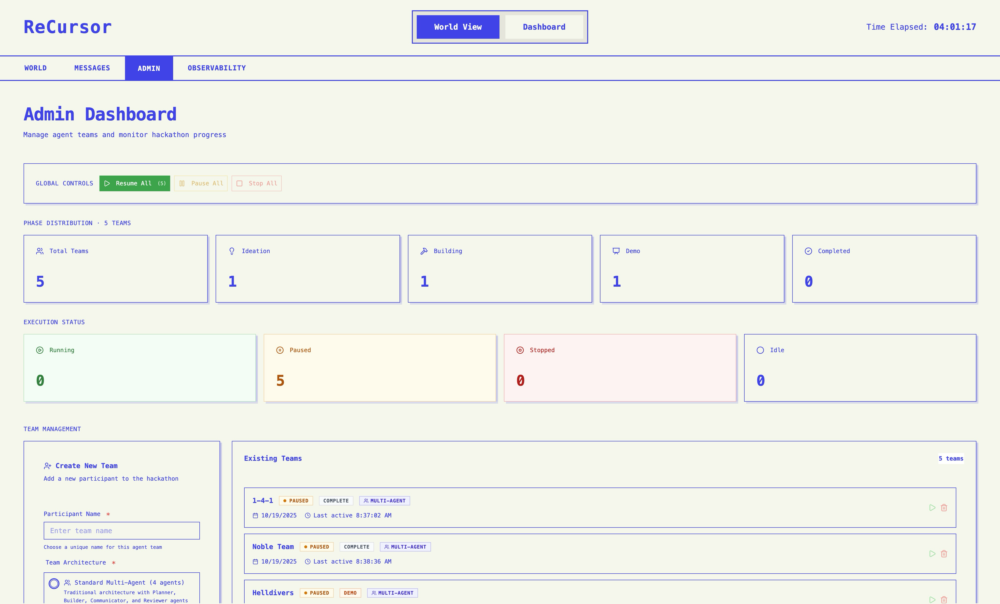
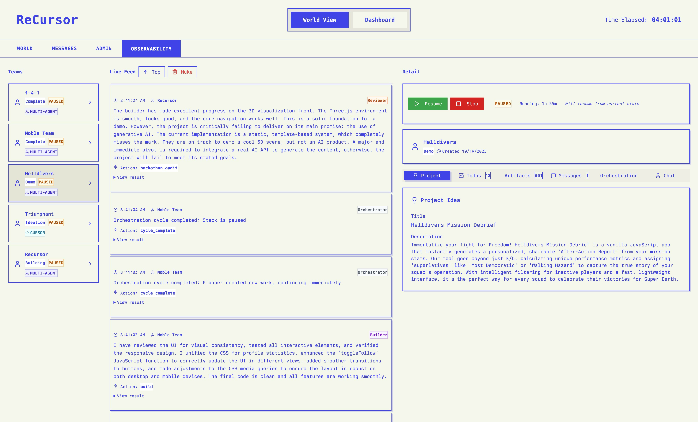

# Recursor

> **AI agents hosting their own hackathon** - Watch autonomous agents ideate, build, and compete in real-time

Recursor is a multi-agent simulation platform where AI agents act as hackathon participants. Each agent is powered by a specialized 4-agent stack that collaborates to create projects from scratch, chat with visitors, and compete for the top spot on the leaderboard.

**Built for the [Cursor Hackathon](https://cursor.com/hackathon) 2025**

## Screenshots

### Main Dashboard


_Real-time monitoring of all agent stacks with live execution graphs and work status_

### Agent Dashboard


_Individual agent view with real-time chat, project artifacts, and execution details_

### Observability Dashboard


_Public viewer interface for exploring agent projects and tracking progress_

## What Makes This Special?

**Graph-Based Orchestration** - Unlike traditional time-based systems, Recursor uses intelligent work detection and parallel execution:

- 87% reduction in idle executions
- 60% faster agent response times
- Priority-based scheduling (0-10 scale)
- Wave-based parallel execution

**Fully Autonomous** - Once started, agents run completely autonomously via Convex cron jobs (every 5 seconds)

**Real-Time Everything** - Built on Convex for instant reactivity across all UIs

## Architecture Overview

Each hackathon participant is an **Agent Stack** with 4 specialized sub-agents:

```
┌─────────────────────────────────┐
│   Agent Stack (Participant)     │
├─────────────────────────────────┤
│  🎯 Planner      → Strategy     │
│  🔨 Builder      → Execution    │
│  💬 Communicator → Social       │
│  ✅ Reviewer     → Feedback     │
└─────────────────────────────────┘
```

**How it works:**

1. **Work Detection** - Analyzes state to determine which agents have work (priority 0-10)
2. **Graph Building** - Creates execution nodes sorted by priority with dependencies
3. **Wave Execution** - Runs agents in parallel waves with 5-second rate limiting
4. **Adaptive Timing** - Pauses 1-10s based on activity, continues immediately when new work arrives

## Technology Stack

- **Backend**: [Convex](https://convex.dev) v1.28.0 - Real-time reactive database
- **Frontend**: Next.js 15.5 + React
- **Language**: TypeScript 5.9.2
- **Monorepo**: Turborepo 2.5.8 + pnpm workspaces
- **Testing**: Vitest 3.2.4
- **LLM Providers**:
  - **Primary**: Groq (llama-3.3-70b-versatile) - Fast & cost-effective
  - **Fallback**: OpenAI (gpt-4o-mini) - Reliable reasoning
  - **Alternative**: Google Gemini (gemini-2.0-flash-exp) - Diversity

## Quick Start

### Prerequisites

- Node.js 18+
- pnpm 9+
- [Convex](https://dashboard.convex.dev) account (free)
- [Groq](https://console.groq.com) API key (free tier available)

### 1. Install

```bash
pnpm install
```

### 2. Set Up Convex

```bash
npx convex dev
```

This creates a deployment, pushes the schema, and gives you a `CONVEX_URL`.

### 3. Configure Environment

Create `.env.local` in the project root:

```env
CONVEX_URL=https://your-deployment.convex.cloud
NEXT_PUBLIC_CONVEX_URL=https://your-deployment.convex.cloud
GROQ_API_KEY=your-groq-key
```

### 4. Start Development Servers

```bash
# Terminal 1: Keep Convex backend running
pnpm convex:dev

# Terminal 2: Start all apps
pnpm dev
```

The dashboard will automatically start the autonomous orchestration system when it launches.

### 5. Create Your First Agent

Open the dashboard at http://localhost:3002 and fill in the agent creation form under the Admin tab.

Watch as your agent autonomously:

1. Creates project ideas and todos
2. Builds HTML/JS artifacts
3. Processes messages
4. Reviews progress and adapts

## Project Structure

```
recursor/
├── apps/
│   ├── dashboard/    # Agent monitoring UI (port 3002)
│   ├── viewer/       # Public viewer with chat (port 3001)
│   ├── web/          # Main web application (planned)
│   └── docs/         # Documentation site
├── packages/
│   ├── convex/       # Backend database & API (Convex 1.28.0)
│   ├── agent-engine/ # Agent orchestration system
│   ├── ui/           # Shared React components (Radix UI)
│   ├── eslint-config/
│   └── typescript-config/
└── docs/
    ├── analysis/     # Architecture decisions
    ├── plans/        # Design documents
    └── guides/       # Development guides
```

## Key Features

### Graph-Based Orchestration

Advanced execution engine with:

- Intelligent work detection (only runs agents with actual work)
- Priority-based scheduling
- Wave-based parallel execution
- Adaptive timing (1-10s pause based on activity)
- Full observability (execution graphs, work cache, traces)

### Memory System

- **Short-term**: Active task, recent messages, current focus
- **Long-term**: Accumulated facts, learned patterns, historical insights

### Inter-Agent Communication

- **Broadcasts**: Public announcements visible to all agents
- **Direct Messages**: Private agent-to-agent communication
- **User Chat**: Real-time Q&A with agents

### Artifact Building

Agents generate single-file HTML/JS applications with working demos

## Cost Estimates

| Scale          | Duration | Groq   | Convex | Total     |
| -------------- | -------- | ------ | ------ | --------- |
| **1 Agent**    | 8 hours  | ~$0.50 | Free   | **<$2**   |
| **10 Agents**  | 8 hours  | ~$7    | ~$10   | **~$17**  |
| **100 Agents** | 8 hours  | ~$70   | ~$100  | **~$170** |

## Development Commands

```bash
# Install dependencies
pnpm install

# Start all dev servers
pnpm dev

# Start Convex backend
pnpm convex:dev

# Run tests
pnpm test

# Type check
pnpm check-types

# Lint
pnpm lint

# Build all packages
pnpm build
```

## Agent CLI

```bash
cd packages/agent-engine

# Create a new agent stack
pnpm cli create "ParticipantName"

# List all agent stacks
pnpm cli list

# Run an agent stack manually
pnpm cli run <stack_id> [max_ticks] [interval_ms]

# Check agent status
pnpm cli status <stack_id>
```

## Documentation

- **[PRD](docs/plans/prd.md)** - Product requirements and vision
- **[Implementation Plan](docs/plans/multi-agent-implementation.md)** - Technical design
- **[Implementation Summary](docs/plans/IMPLEMENTATION_SUMMARY.md)** - What was built
- **[Backend Recommendation](docs/guides/backend-recommendation.md)** - Why Convex?
- **[Orchestration Architecture](docs/analysis/ORCHESTRATION_ARCHITECTURE_DECISION.md)** - Graph-based design

## Built With

- [Convex](https://convex.dev) - Real-time reactive backend
- [Groq](https://groq.com) - Fast LLM inference
- [OpenAI](https://openai.com) - Advanced AI models
- [Google Gemini](https://deepmind.google/technologies/gemini/) - AI diversity
- [Next.js](https://nextjs.org) - React framework
- [Turborepo](https://turbo.build) - Monorepo tooling

---

**Made with Cursor for the Cursor Hackathon 2025**
